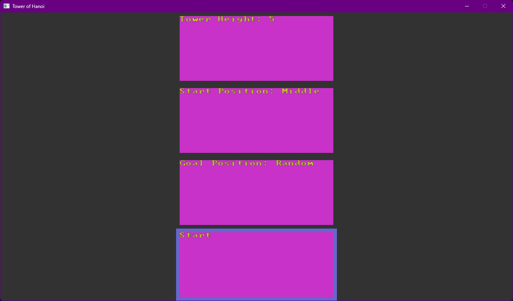
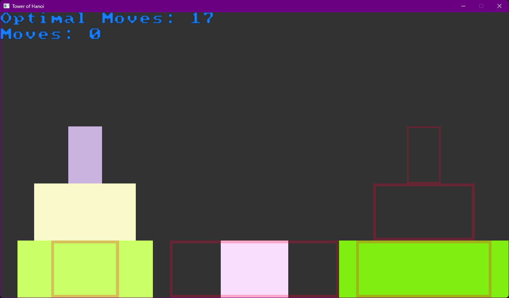
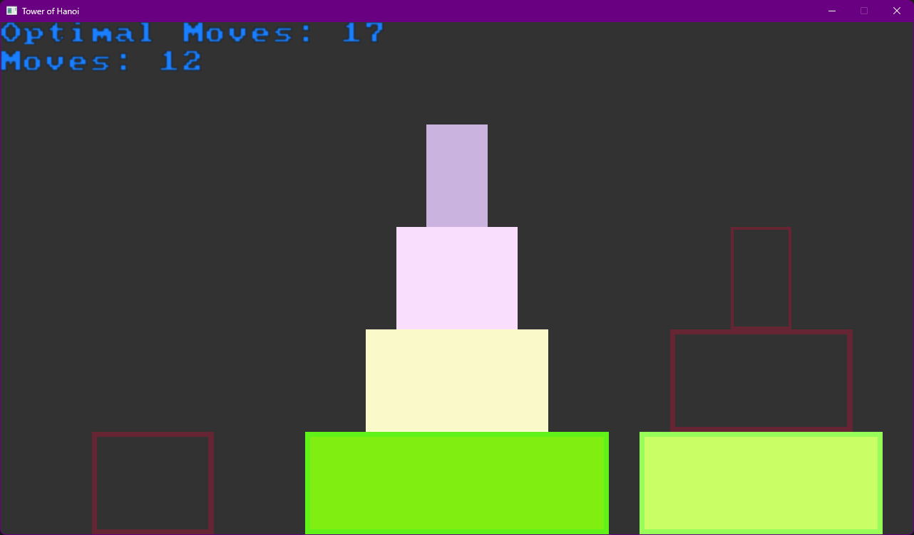
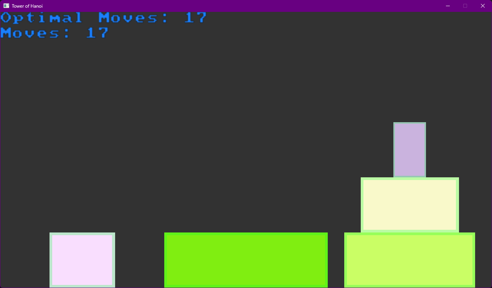

# Tower of Hanoi (SDL3) (WIP)
Tower of Hanoi with extra mode (Random)

# Screenshots
- Main Menu

- Game start

- Gameplay

- End


# Controls
## Main menu
- Mouse:
    - Left Click: select option
    - Left Double click: on start option -> starts the game
- Keyboard:
    - Left arrow: change option value
    - Right arrow: inverted change option value
    - Up arrow: previous option
    - Down arrow: next option
    - Enter: on start option -> starts the game

## Game
- Mouse:
    - Left Click: select disk
        - when 2 different selection -> the disk moves
        - when 2 equal selection -> selection canceled
- Keyboard:
    - R: resets current game (does not reset random position)
    - ESC: back to main menu

# Build
## Prerequisite
- c++ compiler (c++20 preferred)
- cmake (cmake 4.0 preferred)
- SDL3 Library (optional)

## Build commands
replace <path_to:/lib/SDL3> with actual path on your computer<br>

```
cmake -S . -B build -DCMAKE_PREFIX_PATH="<path_to:/lib/SDL3>"
cmake --build .
```

# Next target(s)
- make live demo
- remake main menu
- make resizeable window
- use ttf to display text
- create other ways to display target disk

# License
This project is licensed under the MIT License – see the [LICENSE.txt](LICENSE.txt) file for details.
